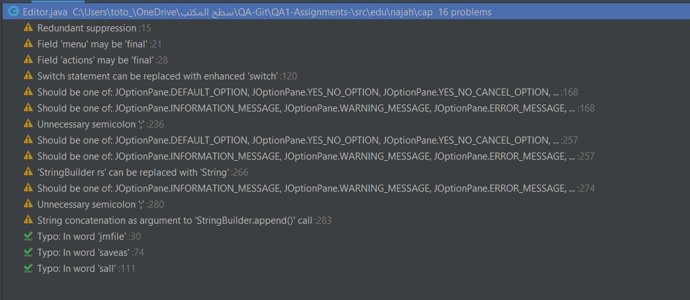
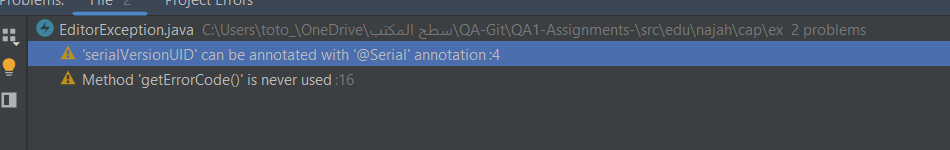
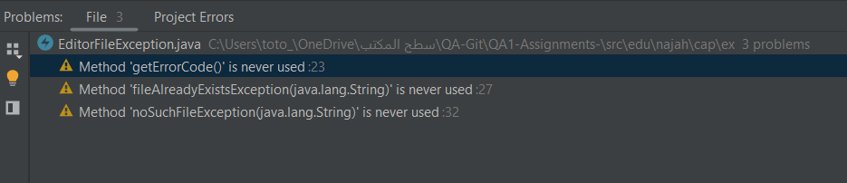
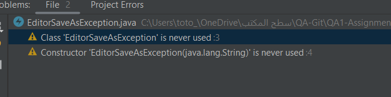
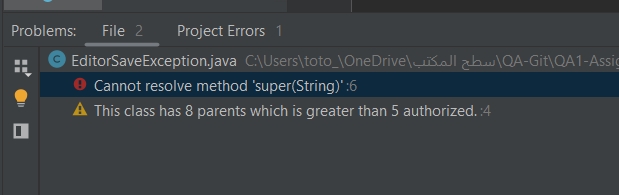
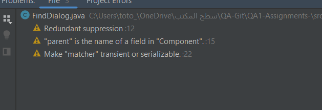

**# Static analyzer

### 1. (127, 3) This block of commented-out lines of code should be removed.
   This was my first sonarlint job malfunction,

#### - Issue Type: Code Smell, Issue Severity: MAJOR.
   This was the description of the problem, after I read it and examined the code, it turned out that there were lines with unnecessary comments that should be deleted, so I got rid of them.

The commented lines of code are likely leftovers from previous code changes, and are no longer necessary. Removing them simplifies the code and makes it easier to read and understand.
Description of the error "Programmers should not comment out code as it bloats programs and reduces readability.
Unused code should be deleted and can be retrieved from source control history if required".


### 2. (293, 14) Remove this unused private "saveAsText" method.
####   - Issue Type: Code Smell, Issue Severity: MAJOR.
   The saveAsText method was defined but not called in the program, which means it had no effect on the behavior of the program.I decided to remove it to make the code more clear and concise.
   I deleted the commented lines block from the code and the saveAsText method because it is not used in the program, and removing them does not affect the functionality of the program.

Description of the error on Sonarlint: "private methods that are never executed are dead code: unnecessary, inoperative code that should be removed. Cleaning out dead code decreases the size of the maintained codebase, making it easier to understand the program and preventing bugs from being introduced .
Note that this rule does not take reflection into account, which means that issues will be raised on private methods that are only accessed using the reflection API."

### 3. (234, 5) Replace this use of System.out or System.err by a logger.
### 3.1 (226, 6) Replace this use of System.out or System.err by a logger.
####  - Issue Type: Code Smell, Issue Severity: MAJOR.
   The SonarLint message "Replace use of System.out or System.err with logger" indicates that the code uses System.out or System.err to print log messages, which is generally considered bad practice. Instead, I used the java.util.logging framework.
   Then I replace all instances of System.out.println() or System.err.println() with logger.info("");

### 4.(209, 14) Refactor this method to reduce its Cognitive Complexity from 26 to the 15 allowed.
### 4.1(129, 13) Refactor this method to reduce its Cognitive Complexity from 45 to the 15 allowed. 
#### - Issue Type: Code Smell, Issue Severity: CRITICAL.
Cognitive complexity is a measure of how difficult it is to understand the control flow of a method. Methods with higher cognitive complexity will be difficult to maintain.
Here are some modifications I made to reduce cognitive complexity:

* Use the switch phrase
Use a switch statement instead of multiple if-else statements to handle different action commands. This can reduce the cognitive complexity of the method and make it easier to read and maintain.
* Move logging to a separate method to reduce code redundancy and make code easier to maintain.
* Use early returns or continue statements to exit the method early if certain conditions are met, rather than nesting further logic within an if-statement.


### 5. Make "variables" a static final constant or non-public and provide accessors if needed
### 5.1 make copy a static final constant or non-public and provide accessors if needed
### 5.2 make paste a static final constant or non-public and provide accessors if needed
### 5.3 make cut a static final constant or non-public and provide accessors if needed
### 5.4 make move a static final constant or non-public and provide accessors if needed
### 5.5 make changed a static final constant or non-public and provide accessors if needed
### 5.6 make Tp a static final constant or non-public and provide accessors if needed
### 5.7 make menu a static final constant or non-public and provide accessors if needed
#### - Issue Type: Code Smell
#### - Issue Severity: Minor.
#### - Issue Description : 
   the issue is that the copy, paste, cut, move and changed  fields are declared as public, which means they can be accessed and modified from anywhere in the code, breaking the encapsulation principle. SonarLint recommend to modify the declaration of the public fields to static final constant or non-public and provide accessor methods to improve encapsulation and maintainability.By following this recommendation, the code becomes easier to understand, test, and modify, while reducing the risk of errors and bugs, ultimately improving software quality.
   So I declare copy, paste, cut , tp , menu and changed as static final Based on constant convention in Java.
   and delete move cause no usage for it 

### 6.extract the nested try block into separate method 
### Issue Type : Code smell
### Issue Severity : Major
### Issue Description : 
   The issue is that we have a nested try block in the editor file, so I created a new method called readFile() which takes a File object as input and returns the contents of the file as a String so the code became more modular and easier to understand.
   and this improves the quality of the code by making it more modular, readable, and maintainable.

### 7. Define constant instead of duplicating 
### 7.1 Define constant instead of duplicating copy 
### 7.2 Define constant instead of duplicating paste
### 7.3 Define constant instead of duplicating cut
### 7.4 Define constant instead of duplicating tp
### 7.5 Define constant instead of duplicating menu
### Issue Type : Code Smell 
### Issue Severity : Critical 
### Issue Description : 
The issue is that we have to use the constant  " PASTE_ITEM", " COPY_ITEM " , " CUT_ITEM " , "MENU" , "TP "  wherever we need to use the  string  in the editor file .
and this improves the quality of the code by improving readability, consistency, scalability, and maintainability.
### 8. Add a default case to this switch.
#### Issue Type : Code Smell 
#### Issue Severity : Critical 
### 9. A "NullPointerException" could be thrown: "writer" is nullable here.
#### Issue Type : Bug
#### Issue Severity : Major
### 9.1
```agsl
private void handleSaveFileAction() {
		int ans = 0;
		if (changeStatus) {
			ans = JOptionPane.showConfirmDialog(null, "The file has changed. You want to save it?", "Save file", 0, 2);
		}
		if (ans != 1) {
			if (file == null) {
				saveAs(actions[1]);
			} else {
				String text = textPanel.getText();
				try (PrintWriter writer = new PrintWriter(file)) {
					if (!file.canWrite()) {
						throw new EditorSaveException("Cannot write file!");
					}
					writer.write(text);
					changeStatus = false;
				} catch (Exception ex) {
					ex.printStackTrace();
				}
			}
		}
	}
```
* Based on this code I noticed that in the handleSaveFileAction() method, the answer variable is not initialized if the changeStatus condition is false, which may result in a NullPointerException when checking its value in the if condition (answer! = 1). To avoid this, you can initialize the ans variable to a default value, such as -1 , before the if (changeStatus) block.
```agsl
private void saveAs(String dialogTitle) {
        dialogTitle = dialogTitle.toUpperCase();
        JFileChooser dialog = new JFileChooser(System.getProperty("user.home"));
        dialog.setDialogTitle(dialogTitle);
        int result = dialog.showSaveDialog(this);
        if (result != 0)//0 value if approve (yes, ok) is chosen.
            return;
        file = dialog.getSelectedFile();
        PrintWriter writer = getWriter(file);
        if (writer!=null){
        writer.write(textPanel.getText());
        }
        changeStatus = false;
        setTitle("Editor - " + file.getName());
    }
```
* There is a problem with the getWriter method, which returns null if an exception is thrown during PrintWriter creation. If writer is null, a NullPointerException will be thrown when trying to call the write method on it at the writer line.write(textPanel.getText());.
To fix this, you can modify the saveAs method to handle the case where the writer is null. One way to do this is to add an if statement to check if the writer is null, and if so, return from the method without writing anything to the file.
In the modified method, if the writer is not null, it will try to write to the file as before. However, we've added a try-catch-final block to catch any IO exceptions that might occur while writing to the file, and to close the writer regardless of whether to write was successful or not.
In the else block, we handle the case where the writer is empty by displaying an error message to the user. You can customize this error message to suit your needs.
### 10.Rename this method name (BuildMenu) to match regular expression " [a-z][a-zA-Z0-9]*$ ".
#### Issue Type : code smell
#### Issue Severity : Minor
### 11. Use static access with "javax.swing.WindowConstants" for "EXIT_ON_CLOSE".
#### Issue Type : Code Smell 
#### Issue Severity : Critical 

### 12. 
```agsl
super("Editor"); 
```
to 
```agsl
setTitle("Simple Editor");
```
* I changed super("Editor"); to setTitle("Simple Editor"); because super("Editor"); sets the title of the frame to "Editor", but in the context of this program, it would be more appropriate to set the title to "Simple Editor" to better reflect the purpose of the program.

* In Swing, JFrame is a subclass of Frame and Frame has a setTitle method that sets the title of the frame. So, instead of calling the constructor of JFrame with a string argument to set the title, I used the setTitle method to set the title of the frame. This is a more direct and explicit way of setting the title of the frame, and it also makes it clear what the title of the frame will be.

### 13. (5, 13) This class has 6 parents which is greater than 5 authorized. few seconds ago
#### - Issue Type: Code Smell, Issue Severity: MAJOR.
* One solution to solve the bug is to refactor the code to reduce the number of EditorException parent classes to less than or equal to 5. This requires restructuring the inheritance hierarchy of the class. The EditorException class can be modified to remove the bug by using syntax instead of inheritance.
  Creates a NoSuchFileException object inside the EditorException class and delegates its methods to that object. In this way, inheritance from NoSuchFileException can be removed and the error we were getting can be avoided.
### 13.1 (6, 16) Make this "errorCode" field final.
#### - Issue Type: Code Smell, Issue Severity: Minor.
* I also added the final keyword to the error code field in the EditorException class declaration. Even make this field static, it will not be possible to modify it once it is initialized.
  This ensures that it can only be set once, is in the constructor, and prevents accidental modification of its value later.

After solving this problem, I encountered a problem with the EditorFileException code,
```agsl
'EditorException(java.lang.String, int)' in 'edu.najah.cap.ex.EditorException' cannot be applied to '(java.lang.String)'
"
``` 
* The problem is with the EditorFileException class, which extends the EditorException class you modified. The EditorException class extends NoSuchFileException , which does not have a constructor that takes only one String parameter.
  So I modified the EditorException class to have a constructor that takes only one String parameter.

* Thus, we no longer need the inner class EditorException inside EditorFileException.
  Because EditorFileException inherits all the functions and properties of its parent classes, including the getMessage() method that returns the message associated with the exception.
  In other words, by removing the inner class EditorException and using the EditorException class defined in the edu.najah.cap.ex package, we can achieve the same result and avoid unnecessary nested classes. This can help make the code simpler and easier to read and maintain.

For this problem:
### 13.2 (3, 13) This row has 7 parents, and this number is greater than the 5 validated parents.
#### - Issue Type: Code Smell, Issue Severity: MAJOR.

* The reason for the new problem is that there are too many parent classes for EditorFileException. In this case, EditorFileException expands EditorException which expands NoSuchFileException which expands FileSystemException which expands IOException which expands Exception which expands Throwable. This is a long chain of inheritance.
  To fix this problem, you need to simplify the inheritance chain. One way to do this is to remove the EditorException class and have EditorFileException extend NoSuchFileException directly.
```agsl
package edu.najah.cap.ex;

import java.nio.file.NoSuchFileException;

public class EditorFileException extends NoSuchFileException {

     public EditorFileException(String message) {
         super(message);
     }

     public EditorFileException(String file, String other, String reason) {
         super(file, other, reason);
     }
}

```

Even after this solution, there is still an error.
### 13.3 (5, 13) This class has 6 parents which is greater than 5 authorized.

So I've removed NoSuchFileException from the list of parent classes and extended IOException instead, this way EditorFileException has only one parent class and doesn't violate the maximum of 5 main classes a class can have.
Next, I added a serialVersionUID field to EditorFileException to avoid any potential issues with serialization, because Exception implements Serializable.
Finally, I kept the same constructors you had in EditorFileException because they are already correct and don't need any modification.
By doing all this, the EditorFileException class now compiles without any errors about having too many parent classes.



This was the set of warnings shown in the file editor,
which worked on fixing it.






This was the set of warnings shown in the files Editor Exception, Editor File Exception, EditorAsSaveException and EditorSaveException
which worked on fixing it.

### 14.1 This blocked of commented-out lines of code should be removed (closeDialog();).
#### Issue Type : Code Smell 
#### Issue Severity : Major
### 14.2 This blocked of commented-out lines of code should be removed (System.out.println(e.getKeyCode());).
#### Issue Type : Code Smell 
#### Issue Severity : Major

### 15.1 Add a nested comment explaining why this method is empty, throw an UnsupportedOperationException or complete the implementation(keyTyped).
#### Issue Type : Code Smell 
#### Issue Severity : Critical
### 15.2 Add a nested comment explaining why this method is empty, throw an UnsupportedOperationException or complete the implementation(keyReleased).
#### Issue Type : Code Smell 
#### Issue Severity : Critical


### 16 (14,8) "parent" is the name of a field in "Component"**
#### Issue Type : Code Smell
#### Issue Severity : Blocker
* The issue is caused by the parent field in the FindDialog class, which conflicts with the parent field defined in the java.awt.Component class.
  To fix this, you can either rename the parent field in the FindDialog class to something else, such as editor.

### 17. (21, 9) Make "matcher" transient or serializable.
#### Issue Type : Code Smell
#### Issue Severity : Critical
* It is recommended that you make the Match field either transient or serializable. To fix this, I worked on adding the "transient" keyword before the "matching" type declaration.